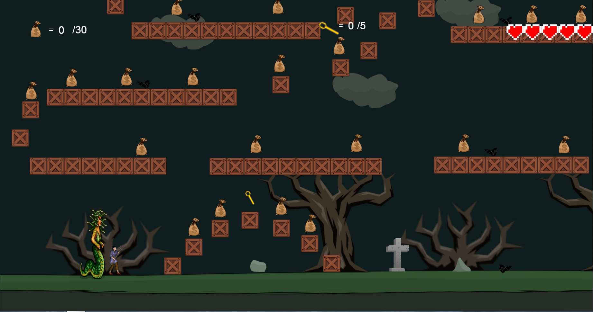
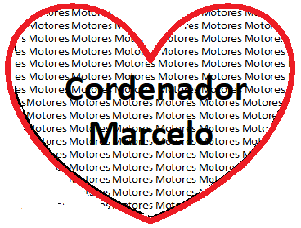

                               *** Bem Vindos!! ***

# Quem sou eu 

 

  Meu nome é Thayna Luana, estou cursando Programação de jogos digitais, no IFRN - Ceára-Mirim, moro em Natal-RN , tenho 17 anos.
  Sou uma pessoa bastante extrovertida , alegre, gosto de fazer bastante amizades, sempre estou disposta á  ajudar o próximo.
  Sou geminiana e muito chorona. Tenho um amor chamada Rayka Gabriely, que foi morar a 2 anos no reinos dos céus. Torço pelo São Paulo e  e em relação ao meu estilo musical curto de tudo um pouco. 
 
 # Rayka Gabriely

 
          
          Essa é a minha cachorrinha Rayka Gabriely, que foi morar com Deus a 2 anos. E ao seu lado Hanna Gabriela.

# Redes Sociais: 

# Portfólio
   # 1° Jogo 
  
   
   # 3° Jogo
   
     

## Games
  Aqui a senhora vai colocar os jogos que a senhora ja fez e que os prints tirados acima mostram...

[Time IF](https://ortegagamer.github.io/home)

[Texto que vai aparecer](link)

## Artes

## Projetos

* Proj Tower Defense
* Proj jogos

# Cordenador da Disciplina: 

 

* * *

** negrito  **
_ itálico  _
~~ riscado  ~~
3* separados por espaço - linha horizontal  
#s uma ou mais hashtsges criam capítulos ou subcapítulos
*s asterico cria lista não ordenada
nºs número seguido de pontuação cria lista ordenada

* * *
