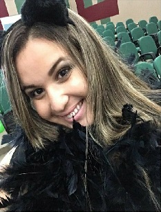

                               *** Bem Vindos!! ***

# Quem sou eu 

 

  Meu nome é Thayna Luana, estou cursando Programação de jogos digitais, no IFRN - Ceára-Mirim, moro em Natal-RN , tenho 17 anos.
  Sou uma pessoa bastante extrovertida , alegre, gosto de fazer bastante amizades, sempre estou disposta á  ajudar o próximo.
  Sou geminiana e muito chorona. Tenho um amor chamada Rayka Gabriely, que foi morar a 2 anos no reinos dos céus. Torço pelo São Paulo e  e em relação ao meu estilo musical curto de tudo um pouco. 
 
# Rayka Gabriely 

 
          
Essa que está no porta retrato é Rayka Gabriely, minha cachorrinha que faleceu a 2 anos,
ao seu lado é Hanna Gabriela, minha cachorra atual que tem 2 anos.
Rayka morreu aos 9 anos grávida da sua 3 gestação. Ela era minha maior companheira

# Redes Sociais:  

# Portfólio
  
## Games
  
 # 1° Jogo
 
 ## SnakeWoman

   
   Primeiro Jogo que fiz na máteria de Oficinas. Foi dado como tema para se fazer o jogo cultura, por estudar em Ceára-Mirim
   eu e minha dupla Lucas Revôredo , resolvemos falar um pouco sobre a lenda de Céara-Mirim, e logo de cara encontramos a lenda da 
   "Mulher que virou Sepernte" e então resolvemos fazer um jogo que retrata uma lenda. Click na foto e acesse o jogo.
  
  
  # 2° Jogo   
  
 ## Piratas   
   
   
  O segundo jogo também ofertado na disciplina de Oficinas, foi feito por Mim e Bruna Noronha, na qual foi ofertado o tema mensagem
  e então fizemos um jogo de um pirata na qual tinha que encontrar uns mapas para desvendar os misterios da carta para pode entender a mensagem que era deixada. Aperte na imagem e veja o jogo.
    
# 3° Jogo
    
  ## Carol Com C
   
   
     
     Nesse jogo o tema foi livre, e foi em trio e eu fiz com João Thiago e Bruna Noronha, nesse jogo procuramos fazer um jogo educacional. Click na imagem e acesse o jogo.
     
     
# 4° Jogo
   
## D-Combate

   
   
   Esse foi um jogo de Tower Defense que eu fiz com Bruna Noronha afim de como projeto a saúde bucal. click na imagem e baixa o projeto
     [Projeto tower](https://victhay.github.io/certo.docx/)

## Artes

artes que elaborei ou que personalizei

   Robô que fiz para um trabalho no animate

 menu que fiz para o jogo dos piratas

  Jogo que fiz pra um jogo educativo

 jogo educativo de carol com c

 fase personalizada do jogo educativo carol com c

 tela do jogo que iria aparecer

 tela do tower defense

 tela de menu do  tower defense

## Jogos não publicados

 jogo feito para a disciplina de animação, cordenado por Durval Pacheco

   jogo de 5 segundos feito com Julia Elizabeth para a disciplina de Jogos Digitais

   jogo de 5 segundos feito com Julia Elizabeth para a disciplina de Jogos Digitais

## Projetos que participei 

* Proj Tower Defense 
* Proj jogos
* Proj Biologia

# Cordenador da Disciplina: 

Professor Marcelo barros : 
Acompanha a turma do curso Programação de Jogos Digitais desde do primeiro ano de curso
quando ofertou no curriculo dos alunos Interfaces, no Segundo ano ensinou P.O.O e no
terceiro ano oferta Motores e Oficinas.
Foi também cordenador do curso de Programação de Jogos Digitais.

 

# Curiosidades

* Namoro 
* Não sei ainda o que eu quero fazer na faculdade ainda
* Sou filha única
* Não sou boa em programação
* Amo fazer as partes gráficas dos jogos
* Participei da parte da divulgação do 1° musical do Ifrn-Céara-Mirim Chamado de Tîe.
Acompanhe:
 

* * *

* * *
